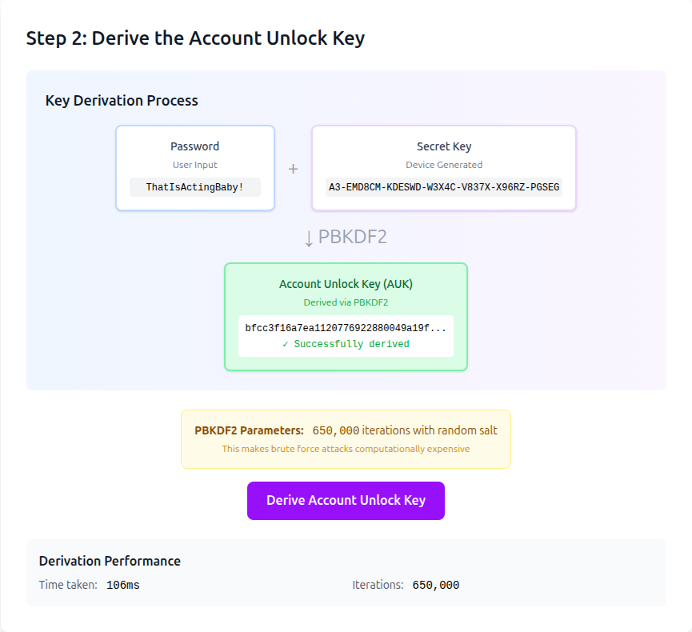

# lib1password-unofficial

[](https://opensource.org/licenses/MPL-2.0)
[](https://github.com/edeckers/lib1password-unofficial/actions/workflows/deploy.yml)

**This is 1Password's end-to-end encryption model (Secret Key, two-secret key derivation, keysets and encrypted vaults) as a small TypeScript library you can run, read and build on.**

Use it to:

- **Understand zero-knowledge encryption** by running it instead of reading about it, and see how a password manager can have its entire server database stolen and still keep your vault safe
- **Prototype your own end-to-end encrypted app** on a proven design: storage and authentication are interfaces, so it plugs into whatever backend you have
- **Teach or write about it** with working code and an interactive explainer to point to

It follows [1Password's white paper](https://1passwordstatic.com/files/security/1password-white-paper.pdf) closely enough that you could decrypt items from your real 1Password vault with your own credentials.

<p align="center">
  <a href="https://passwords.lgtm.it"></a>
</p>

<p align="center"><b><a href="https://passwords.lgtm.it">Try the interactive explainer →</a></b></p>

- **Featured on TypeScript.fm:** [Episode 39 (33m25s)](https://typescript.fm/39#t=33m25s)
- **Blogpost:** [Read on Medium](https://medium.com/@edeckers/stopping-bad-actors-inside-1passwords-security-model-8c65c6acb9ff)
- **Explainer source:** https://github.com/edeckers/lib1password-unofficial/tree/gh-pages

Published with the 1Password team's blessing, though it's not an official product developed or maintained by AgileBits, Inc.

## How it works

Your vault items are encrypted with a vault key, the vault key with your keyset, and your keyset with your Account Unlock Key (AUK). The server stores all of these, encrypted. The AUK itself is never stored or sent anywhere: your device derives it from your password _and_ your Secret Key, 128 bits of randomness generated on your device. Someone who steals the server's data can't brute-force your password to decrypt it, because without the Secret Key every password guess is also a guess at those 128 random bits.

### Reading along with the white paper

Each concept from the [white paper](https://1passwordstatic.com/files/security/1password-white-paper.pdf) lives in one place in the code, so you can read the two side by side:

| Concept                                                              | Code                                                                                                                   |
| -------------------------------------------------------------------- | ---------------------------------------------------------------------------------------------------------------------- |
| Secret Key: generation, format, obfuscation and rotation             | [`SecretKey.ts`](src/lib/Account/SecretKey.ts)                                                                         |
| Two-Secret Key Derivation: password + Secret Key → AUK               | [`AccountUnlockKey.ts`](src/lib/Account/AccountUnlockKey.ts)                                                           |
| Account creation: master keyset, RSA key pair and personal vault     | [`AccountCreator.ts`](src/lib/Account/AccountCreator.ts)                                                               |
| Unlocking keysets with the AUK                                       | [`KeysetDecryptor.ts`](src/lib/Keysets/KeysetDecryptor.ts), [`EncryptedKeyset.ts`](src/lib/Keysets/EncryptedKeyset.ts) |
| Vault keys and encrypted items                                       | [`Vault.ts`](src/lib/Vault/Vault.ts)                                                                                   |
| Changing your password or rotating your Secret Key                   | [`Session.ts`](src/lib/Session.ts)                                                                                     |
| AES-256-GCM primitives                                               | [`Encryption.ts`](src/lib/Encryption.ts)                                                                               |
| Authentication, which the library leaves to you (1Password uses SRP) | [`SrpxAuthenticator.ts`](src/lib/Example/SrpxAuthenticator.ts), an example                                             |

## Installation

The package is published to GitHub Packages, which requires a GitHub token with the `read:packages` scope, even for public packages. Point the `@edeckers` scope at GitHub Packages in your project's `.npmrc`:

```ini
@edeckers:registry=https://npm.pkg.github.com
//npm.pkg.github.com/:_authToken=${GITHUB_TOKEN}
```

Then install it with a token in `GITHUB_TOKEN`. If you use the GitHub CLI, you can grant its token the scope and use that:

```bash
gh auth refresh --scopes read:packages
GITHUB_TOKEN=$(gh auth token) npm install @edeckers/lib1password-unofficial
```

## Quick Start

### PHASE 0: Preparation

```ts
import {
  AccountCreator,
  AuthenticationFlow,
  RegistrationInfo,
} from "@edeckers/lib1password-unofficial";

// Example implementations of the storage and authentication
// interfaces, meant for experimenting rather than real use
import {
  InMemoryAccountRepository,
  InMemoryVaultRepository,
  SrpxAuthenticator,
  SrpxProfileAuth,
} from "@edeckers/lib1password-unofficial/examples";

// Library is storage-agnostic, so user profiles, keysets,
// and vaults can live anywhere, and storage is abstracted
// using repositories. InMemoryAccountRepository stores both
// keysets and profiles
const accounts = new InMemoryAccountRepository();
const vaults = new InMemoryVaultRepository();

// Library is not concerned with authentication, so you can use
// an authentication backend of your choosing by implementing the
// Authenticator interface, e.g. authentication through SRP, which
// is what 1Password uses. The example SrpxAuthenticator looks up an
// account's auth parameters (salt, iterations), derives a key from
// them, and hands that key to your server
const profileAuths = new Map<string, SrpxProfileAuth>();
const authenticator = new SrpxAuthenticator(
  async (accountId) => {
    const profileAuth = profileAuths.get(accountId);
    if (!profileAuth) {
      throw new Error(`No auth parameters for account ${accountId}`);
    }

    return profileAuth;
  },
  async (srpxKey) => {
    // Send srpxKey to your server and throw if authentication fails
  },
);
```

### PHASE 1: Create and store an account

```ts
const accountCreator = new AccountCreator(accounts, accounts, vaults);

// Generate a secret key and store it in a RegistrationInfo-object
// together with the provided email address
const registrationInfo = await RegistrationInfo.create(
  "user@example.com",
  "super-secret-password",
);

// The previous step generates the secret key, which
// should never leave the device it was generated
// on, and be stored securely by the user. We'll
// use it to unlock our vault in PHASE 2
const { secretKey } = registrationInfo;

// Your server keeps the auth parameters it needs to verify the
// account's future logins
profileAuths.set(secretKey.accountId, authenticator.createProfileAuth());

// Generate a master keyset and an empty personal vault, encrypted
// with your Account Unlock Key (AUK, combination of
// password + secret key). Store this encrypted data in the provided
// repositories
await accountCreator.create(registrationInfo);
```

### PHASE 2: Retrieve and unlock an account

```ts
// The AuthenticationFlow is a convenience class that
// runs you through every step, from authentication to
// unlocking your vaults in a single call
const auth = new AuthenticationFlow(authenticator, accounts, vaults);

// A successful login returns a Session object, which
// contains a SecretKey and a list of Vault-objects. Each
// of the Vault objects represents an unlocked Vault
// which allows you to directly list, decrypt and modify
// every item it contains
const session = await auth.login(
  "user@example.com",
  "super-secret-password",
  secretKey,
);
```

### PHASE 3: List and decrypt items

```ts
// Take any vault from session.vaults, or use the
// convenience method session.getPersonalVault() to
// retrieve your primary Vault
const vault = session.getPersonalVault();
if (!vault) {
  throw new Error("Account has no personal vault");
}

// Decrypt all vault items, and return them as a list
const items = await vault.readAllItems();

// Each item has an id (string) and decrypted
// data (ArrayBuffer). Use .serialize() to get
// the plaintext string
console.log(
  items.map((i) => ({
    id: i.id,
    data: i.serialize(), // ArrayBuffer -> string
  })),
);
```

## API Reference

### Session

| Member                                      | Description                                                                                                                                               |
| ------------------------------------------- | --------------------------------------------------------------------------------------------------------------------------------------------------------- |
| `secretKey`                                 | The account's secret key                                                                                                                                  |
| `vaults`                                    | List of unlocked vaults                                                                                                                                   |
| `getPersonalVault()`                        | Convenience method to get the primary vault                                                                                                               |
| `changeCredentials(emailAddress, password)` | Change email address and/or password by re-encrypting the master keyset, leaving the secret key unchanged. Returns a new Session with updated credentials |
| `rotateSecretKey()`                         | Rotate the secret key (preserving version and accountId) and re-encrypt the master keyset. Returns a new Session with the new secret key                  |

### SecretKey

| Member           | Description                                                                              |
| ---------------- | ---------------------------------------------------------------------------------------- |
| `version`        | Secret key format version (e.g., "A3")                                                   |
| `accountId`      | The 6-character account identifier                                                       |
| `secret`         | The 26-character secret portion                                                          |
| `fullWithDashes` | Formatted secret key with dashes (e.g., "A3-XXXXXX-...")                                 |
| `rotate()`       | Generate a new secret key with the same version and accountId but different secret bytes |

### AuthenticationFlow

| Method                                     | Description                    |
| ------------------------------------------ | ------------------------------ |
| `login(emailAddress, password, secretKey)` | Authenticate and unlock vaults |

## Disclaimers

This library is provided as is, without warranty of any kind; see the [license](LICENSE). It hasn't been audited, so have it reviewed before it protects real people's secrets.

- Built by someone who is not a security expert or cryptographer
- Not audited or reviewed by security professionals
- May contain implementation errors or vulnerabilities
- Not affiliated with 1Password

## Rationale

For years, I've used password managers, which got me curious about how they work under the hood. And to me the best way to truly understand something is to actually build it. So I created this library to:

1. Understand the model: how do Secret Keys, Keysets and Vaults work together?
1. Share knowledge: an interactive demo helps others learn too

## Contributing

See the [contributing guide](CONTRIBUTING.md) to learn how to contribute to the repository and the development workflow.

## Code of Conduct

This project follows the [Contributor Code of Conduct](CODE_OF_CONDUCT.md). By participating, you agree to abide by its terms.

## Security issues

The security policy of this project is described in [SECURITY.md](SECURITY.md)

## Acknowledgments

- **1Password** for building an awesome product and publicly documenting their security model in [their excellent white paper](https://1passwordstatic.com/files/security/1password-white-paper.pdf)
- **David Schuetz** [whose blog series on the 1Password model](https://darthnull.org/inside-1password/) popped up a little late on my radar in my own learning process, but their examples definitely filled some missing pieces

## License

[MPL-2.0](LICENSE)
